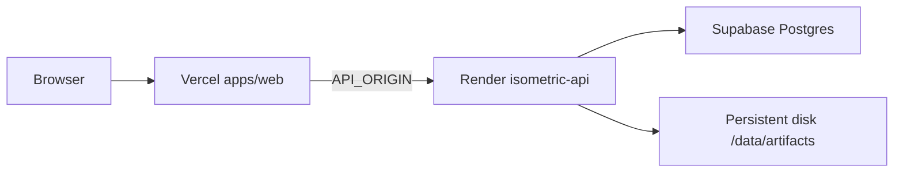

# Deployment (Vercel + Render + Supabase)

Staging topology: **Next.js** on Vercel proxies to **FastAPI** on Render; **PostgreSQL** stays on Supabase Cloud (`bhezwfoifroyidfwdvcy`).



## Repository

- GitHub: `moizk678/isometric`, branch `main`
- Render workspace: **My Workspace** (`moizk678@gmail.com`)

### Render GitHub access (required once)

The `isometric` repo is **private**. Render must be allowed to read it:

1. Open [GitHub → Settings → Applications → Render](https://github.com/settings/installations) → **Configure**.
2. Under repository access, include **`moizk678/isometric`** (or grant all repos).
3. Create the service via [Render Blueprint](https://dashboard.render.com/blueprints) → **New Blueprint Instance** → connect `moizk678/isometric` (uses root [`render.yaml`](../render.yaml)), **or** use Render MCP `create_web_service` with the same build/start commands.

After GitHub access is granted, attach a **persistent disk** (10GB) mounted at `/data` if not created by the blueprint.

## Render (`isometric-api`)

| Setting | Value |
|--------|--------|
| Runtime | Python 3.12 |
| Region | `singapore` |
| Plan | `2c-4g` or higher (PyTorch + OpenCV) |
| Build | `pip install -r requirements-dev.lock && chmod +x scripts/migrate-deploy scripts/render-start && ./scripts/migrate-deploy` |
| Start | `./scripts/render-start` |
| Health check | `/health` |
| Disk | Mount `/data` → `ARTIFACT_ROOT=/data/artifacts` |

### Render environment variables

| Variable | Purpose |
|----------|---------|
| `SUPABASE_DATABASE_URL` | Supabase pooler URL (`:6543`, user `postgres.<project_ref>`) |
| `ARTIFACT_ROOT` | `/data/artifacts` |
| `SKIP_INLINE_WORKER` | `1` (worker loop in `render-start`) |
| `VISION_ENABLED` | `false` for staging unless vision keys are set |
| `REQUIRE_OWNER_HEADER` | `true` |
| `PYTHON_VERSION` | `3.12.12` |

Do not commit database passwords or API keys.

## Vercel (`isometric`)

| Setting | Value |
|--------|--------|
| Root directory | `apps/web` |
| Install | `cd ../.. && pnpm install --frozen-lockfile` (see [`apps/web/vercel.json`](../apps/web/vercel.json)) |
| Build | `pnpm build` |

### Vercel environment variables

| Variable | Purpose |
|----------|---------|
| `API_ORIGIN` | Render service URL, e.g. `https://isometric-api.onrender.com` |
| `DEV_OWNER_ID` | `staging-owner` (proxy injects `X-Owner-Id`) |
| `NEXT_PUBLIC_SUPABASE_URL` | `https://bhezwfoifroyidfwdvcy.supabase.co` |
| `NEXT_PUBLIC_SUPABASE_PUBLISHABLE_KEY` | Supabase publishable key |

Production URL (team): `https://isometric-moiz-khans-projects-5bc55b0b.vercel.app`

## Migrations

Apply against Supabase before or during first API deploy:

```sh
./scripts/migrate-replay   # local, with .env
```

Render build runs `./scripts/migrate-deploy` (non-interactive).

## Smoke tests

```sh
curl -fsS "https://isometric-api.onrender.com/health"
curl -fsS -H "X-Owner-Id: staging-owner" "https://isometric-api.onrender.com/api/v1/documents"
```

Open the Vercel URL → **Documents** (scoped to `staging-owner`).

## Limits and follow-ups

- Vercel request body limits may block large uploads through the proxy; see Run 19 for direct-to-API upload or S3 artifacts.
- Scaling beyond one Render instance requires S3 `ArtifactStore` and an external queue (not implemented yet).
