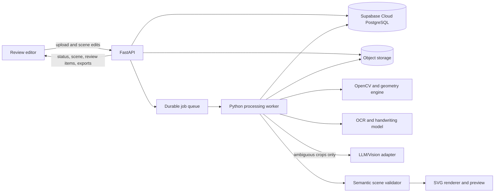

# Implementation Architecture: Hand-Drawn Engineering Sketch to SVG

**Status:** implementation baseline  
**Primary profile:** single-page piping isometric sketches  
**Companion specification:** [hand_drawn_to_svg_system_spec.md](hand_drawn_to_svg_system_spec.md)  
**UI design authority:** [system-design/design.md](system-design/design.md) and its routed component/foundation files

## 1. Decisions and boundaries

The product turns a scanned or photographed piping sketch into an editable semantic drawing and exports that drawing as SVG. The semantic scene is the saved document. SVG and previews are derived artifacts. Every inferred object retains a link to the source image so a reviewer can verify it.

| Concern | Implementation decision |
|---|---|
| Initial inputs | PNG and JPEG, one page per job; PDF follows after the core pipeline is measured. |
| Initial outputs | Semantic JSON, editable SVG, raster preview, and a review queue. |
| Processing | Asynchronous Python worker. The API does not process images inside an HTTP request. |
| Geometry authority | OpenCV/scikit-image extraction followed by a deterministic geometry and topology engine. |
| Text authority | OCR/handwriting model produces candidates; a user correction is authoritative. |
| LLM/Vision API | Optional ambiguity resolver for bounded crops and constrained labels. It cannot author geometry or SVG. |
| Persistence | Supabase Cloud hosts PostgreSQL for jobs, revisions, object metadata, and review events. Object storage holds original and derived files. |
| Frontend | Next.js/React review editor following `system-design` in product mode. Edits apply to scene objects through the API; the server regenerates SVG. |
| First deployment | One API service, one worker service, Supabase Cloud PostgreSQL, object storage, and a durable queue. No microservice split is needed. |

Out of scope for the first release: CAD claims, verified engineering measurements, automatic BOM generation, multi-page PDF, and unattended approval of ambiguous engineering semantics. Dimensions are labels unless a reviewer explicitly calibrates scale. A line crossing does not become a connection merely because pixels overlap.

### Architecture overview



The worker can run locally with filesystem-backed object storage and a queue adapter during development. Production uses Supabase Cloud for PostgreSQL plus an S3-compatible bucket and a durable queue; the choice of artifact-storage and queue providers remains separate from the database-hosting decision. Keep the worker stages in one codebase, with explicit typed contracts, until volume or ownership makes a split useful.

## 2. End-to-end job lifecycle

```text
Job:      queued → running(stage) → succeeded | failed | canceled
Revision: machine_draft → review_required | ready
          review_required → reviewed revision → review_required | ready
Export:   immutable artifact tied to one revision (no document/job state change)
```

Job state describes processing only. Revision state describes whether engineering interpretation still needs review. An export is an artifact, not a terminal job or document state. A succeeded job may therefore produce a `review_required` revision. The UI displays both states separately.

1. The API validates file type, size, dimensions, and page count; computes SHA-256; stores the immutable original; creates a job and enqueues it.
2. A worker claims the job, writes a stage manifest, and runs the deterministic pipeline. Each stage reads immutable inputs and writes versioned artifacts.
3. OCR and symbol classifiers return candidates. The optional vision adapter only receives selected ambiguous crops after those candidates exist.
4. The geometry engine builds the scene. The validator checks schema, references, topology, and renderability.
5. The renderer produces SVG and preview from the validated scene. The review planner creates actionable items with source crops and proposed values.
6. The frontend displays the original and generated drawing in linked views. A correction creates a new scene revision and regenerates the export.

The client supplies an idempotency key for a logical upload request. A unique `(owner_id, idempotency_key)` record maps retries of that request to one document/job; reusing the key with different bytes or options is a conflict. A processing attempt is identified by `(job_id, attempt_number)` and carries the input hash plus pipeline/profile/options versions. Queue delivery is at-least-once, so publication uses a unique result key per job and compare-and-swap on the current revision. Worker leases and retry counts live in the queue, while stage status and error details live in PostgreSQL. A retry must not create duplicate revisions or overwrite a reviewed scene.

### Stage contract

Every stage returns `{artifact_uri, schema_version, producer_version, input_hash, metrics, warnings}` and either `success`, `partial`, or `failed`. Store artifacts by document, job, stage, and producer version. This allows replay from a failed stage and comparison between pipeline versions without altering the original.

| Stage | Main input | Main output | Failure policy |
|---|---|---|---|
| Ingest | Original file | Source metadata and hash | Reject invalid or unsafe input. |
| Normalize/rectify | Original | Page image, transform matrices, quality flags | Continue unrectified when boundary confidence is low. |
| Grid/color separation | Page image | Grid mask, ink masks, color layers | Keep original ink when grid removal may erase strokes. |
| Region detection | Ink/page | Text, symbol, dimension, and geometry candidate regions | Retain unknown regions. |
| OCR | Text crops | Transcriptions and alternatives | Queue unreadable text for review. |
| Geometry | Geometry masks | Centerline primitives, axes, junction candidates | Preserve unsnapped primitives when axis evidence is weak. |
| Topology | Primitives and symbols | Node/edge candidates and connection evidence | Mark crossings as unresolved. |
| Interpretation | Ambiguous crops and candidates | Constrained text/symbol/association suggestions | Skip on timeout or policy opt-out. |
| Scene assembly | All candidates | Semantic scene revision | Reject broken references; retain diagnostic artifacts. |
| Render/validate | Scene | SVG, preview, metrics, review items | Fail export if SVG is invalid; keep scene for repair. |

## 3. Coordinate and geometry contract

Use **rectified page pixel coordinates** as the canonical 2D scene space. The origin is the top-left of the rectified page, with `x` right and `y` down. Coordinates are floating-point numbers. Define *source coordinates* as decoded pixel coordinates of the immutable input file **before EXIF orientation**. The source viewer displays an orientation-normalized derivative, not the raw JPEG. Store `source_to_display` for EXIF orientation, `source_to_page` for orientation plus rectification, and their inverses, including identity/fallback cases. A scene object stores a crop polygon or bounding box in raw source coordinates; the UI maps it through `source_to_display` for the original viewer and through `source_to_page` for SVG alignment. SVG `viewBox` equals the rectified page dimensions. Stage schemas must label their coordinate space explicitly and reject mixed-space points.

Do not turn a handwritten dimension into a drawing scale by default. Keep its parsed value and unit separately from its geometric span. Calibration, when supported, records an explicit scale estimate with evidence and an approval state. Export is visually faithful and semantically editable; it is not automatically a dimensional CAD model.

### Deterministic reconstruction sequence

1. Detect page corners and rectify. Retain the unrectified branch if corner confidence is low.
2. Estimate background/grid periodicity from lightness, color, width, and orientation. Subtract only pixels classified as background; keep a diagnostic grid mask.
3. Segment ink by color and protect text/symbol regions from line fitting. Keep a residual `unclassified_ink` mask so removal mistakes are visible.
4. Skeletonize likely route strokes, detect endpoints and branch pixels, and fit straight-line candidates for the first piping profile. Store both original centerline samples and fitted primitives. Keep curved marks as unresolved source evidence until an arc primitive is added to the scene schema and renderer in a later version.
5. Infer isometric axes from a robust circular angle histogram of long line candidates, optionally aided by a reliable grid. Snap only when angular and endpoint residuals pass profile thresholds. Preserve pre-snap coordinates.
6. Merge collinear fragments if their gap, angle, color layer, and intervening symbol evidence allow it. Split at verified junctions and symbol attachment points.
7. Generate separate hypotheses for a crossing, tee, elbow, and intentional endpoint. Use stroke continuity, color, occlusion, symbol, and nearby annotation evidence. Ambiguous crossings become review items rather than forced connections.
8. Detect dimension lines, extension lines, and arrowheads. Associate a parsed dimension value using location and orientation. Never resize route geometry to satisfy a dimension label automatically.
9. Assemble graph nodes and edges, then validate connectivity and object references. Shared endpoint node IDs and symbol ports are the sole source of pipe connectivity; visually intersecting coordinates alone are not connections. The graph is the input to the SVG renderer.

Profile thresholds belong in versioned configuration (`profiles/piping_isometric.yaml`) and are tuned against a held-out drawing set. The spec's example four-degree snap threshold is a starting point, not a universal rule. Every snap records angle delta, displacement, axis, and confidence evidence.

## 4. LLM/Vision interpretation lane

The API improves interpretation of messy annotations and ambiguous marks. It is outside the coordinate-producing path. OpenCV, OCR, and geometry reconstruction still run when the vision provider is disabled or unavailable.

### Invocation policy

Escalate only when a deterministic candidate has low confidence or competing candidates are close: unclear handwriting, unknown symbols, or uncertain note-to-object associations. Do not send every page to the provider. The adapter receives a bounded crop, a small amount of context, OCR alternatives, allowed symbol IDs, and candidate object IDs. It receives no SVG authoring instruction.

Example request to the internal adapter:

```json
{
  "request_id": "interp_01",
  "kind": "symbol_label",
  "crop_uri": "private://doc_01/crops/crop_42.png",
  "ocr_candidates": ["BV", "B V"],
  "candidates": [
    {"id": "symhyp_42_ball", "label": "ball_valve"},
    {"id": "symhyp_42_bleed", "label": "bleed_valve"},
    {"id": "symhyp_42_unknown", "label": "unknown"}
  ],
  "nearby_object_ids": ["pipe_7", "note_3"],
  "context": {"drawing_profile": "piping_isometric", "nearby_text": "Block + Bleed Ball Valve"}
}
```

Required response after local schema validation:

```json
{
  "request_id": "interp_01",
  "selected_candidate_id": "symhyp_42_ball",
  "evidence": ["Nearby note names a ball valve", "Crop resembles valve mark"],
  "uncertainty": "medium",
  "alternative_candidate_ids": ["symhyp_42_bleed"]
}
```

The response schema has **no fields for paths, points, bounding boxes, dimensions, graph edges, or SVG**. A `selected_candidate_id` must come from the supplied candidates; a separate annotation-association request uses supplied target IDs, never free-form object IDs. Reject unknown IDs, extra geometry fields, and invalid JSON. Treat the provider's uncertainty as a suggestion, not a calibrated confidence score. The local resolver combines it with OCR and classifier evidence; uncertain engineering meanings remain in the review queue. User-confirmed corrections always win.

Apply a hard timeout, limited retries with backoff, concurrency cap, and per-job crop budget. Store request and response metadata, model identifier, prompt version, and policy decision. Keep image crops in private storage, send only the region needed, and provide an organization setting to disable external calls. Redact filenames and unrelated page content. The adapter must log no raw image payloads or credentials.

## 5. Semantic scene schema

The scene format is versioned and independently validated. Use Pydantic models in Python and generate TypeScript types or JSON Schema for the frontend. Object IDs are stable UUIDs or ULIDs; a revision may change an object's fields without changing its ID. Deleted objects become tombstones in the revision event log so old review links remain meaningful.

```typescript
type PagePoint = { x: number; y: number };   // rectified page pixels
type SourcePoint = { x: number; y: number }; // immutable input pixels, before EXIF
type Evidence = {
  sourcePolygon: SourcePoint[];
  stage: string;
  artifactId: string;
  observations: Record<string, number | string | boolean>;
};
type Interpretation = {
  state: "machine" | "confirmed" | "rejected" | "unknown";
  score?: number;                       // calibrated per task, never provider self-score
  evidence: Evidence[];
};
type SceneObjectBase = {
  id: string;
  layerId: string;
  interpretation: Interpretation;
};
type PipeSegment = SceneObjectBase & {
  type: "pipe_segment";
  startNodeId: string;
  endNodeId: string;
  primitive: { kind: "line"; start: PagePoint; end: PagePoint };
  originalPrimitive?: { start: PagePoint; end: PagePoint };
};
type Junction = SceneObjectBase & {
  type: "junction";
  position: PagePoint;
  kind: "endpoint" | "elbow" | "tee" | "crossing" | "unknown";
};
type SymbolObject = SceneObjectBase & {
  type: "symbol";
  symbolId: string;
  anchor: PagePoint;
  rotationDegrees: number;
  portNodeIds: Record<string, string>; // library port name → scene junction ID
};
type Annotation = SceneObjectBase & {
  type: "annotation";
  recognizedText: string;
  normalizedText: string;
  alternatives: string[];
  anchor: PagePoint;
  targetObjectId?: string;
};
type Dimension = SceneObjectBase & {
  type: "dimension";
  displayText: string;
  parsedValue?: number;
  unit?: string;
  witnessStart: PagePoint;
  witnessEnd: PagePoint;
  targetObjectIds: string[];
};
type UnknownMark = SceneObjectBase & {
  type: "unknown_mark";
  sourceCropId: string;
  candidateLabels: string[];
};
type DrawingObject = PipeSegment | Junction | SymbolObject |
  Annotation | Dimension | UnknownMark;

type DrawingScene = {
  schemaVersion: "1.0";
  documentId: string;
  revisionId: string;
  parentRevisionId?: string;
  profileId: "piping_isometric";
  page: {
    sourceWidthPx: number;
    sourceHeightPx: number;
    displayWidthPx: number;
    displayHeightPx: number;
    widthPx: number;
    heightPx: number;
    sourceToDisplay: number[];          // row-major 3x3 EXIF orientation
    displayToSource: number[];
    sourceToPage: number[];             // row-major 3x3 homography
    pageToSource: number[];
  };
  layers: { id: string; name: string; sourceColor: string; renderColor: string }[];
  objects: DrawingObject[];
  relationships: {
    id: string;
    type: "annotates" | "measures" | "callout_targets";
    fromId: string;
    toId: string;
    interpretation: Interpretation;
  }[];
};
```

### Scene invariants

- Every referenced object, node, and layer ID exists in the same revision.
- Pipe endpoints coincide with their referenced junction positions within a profile tolerance; the renderer uses the junction coordinate.
- Connectivity is represented only by pipe endpoint node IDs and symbol ports. A crossing may have two geometrically intersecting pipes with distinct node IDs and no connection.
- A structural elbow/tee junction is rendered once. A separate fitting symbol is rendered only when the source or reviewer explicitly identifies a physical fitting; never create both from the same inferred junction by default.
- A symbol's `portNodeIds` keys are valid names from its pinned library definition; required ports are attached to existing junctions or explicitly unresolved.
- Dimension value and unit are independent of pixel span.
- Text has both recognized and normalized forms; editing never destroys the recognized source value.
- Every machine object has source evidence; every confirmed object has a review event.
- Non-finite numbers, external SVG references, script content, and unsupported object types are rejected.

## 6. Persistence and artifacts

Use PostgreSQL tables with foreign keys and migrations:

| Table | Essential fields |
|---|---|
| `documents` | `id`, `owner_id`, `source_hash`, `source_uri`, `source_mime`, dimensions, creation time, current revision ID. |
| `jobs` | `id`, document ID, state, stage, attempt, input/options hashes, pipeline/profile versions, result revision ID, timestamps, error code. |
| `outbox_events` | ID, event type, aggregate ID, payload, publish state, attempt count, created/published times; unique event key. |
| `stage_runs` | job ID, stage, status, input hash, producer version, artifact URI, metrics JSON, warnings JSON. |
| `scene_revisions` | ID, document ID, parent ID, schema version, scene URI, author type, review state, created time, validation status. |
| `review_items` | ID, stable issue key, revision ID, object/relationship ID, issue type, severity, crop URI, proposed options, state (`open`, `confirmed`, `corrected`, `acknowledged_unknown`). |
| `review_events` | ID, stable issue key, source/result revision IDs, old/new value, actor ID, timestamp. |
| `exports` | ID, revision ID, kind, URI, checksum, renderer version, created time. |
| `interpretation_calls` | ID, job ID, crop ID, provider/model/prompt versions, request/response URIs, outcome, latency and token usage. |

Object storage layout: `documents/{id}/original`, `jobs/{id}/stages/{stage}/{hash}`, `documents/{id}/revisions/{revision_id}/scene.json`, and `documents/{id}/exports/{revision_id}/{format}`. Use immutable keys and checksums. PostgreSQL and object storage do **not** share an atomic transaction: write and validate immutable artifacts first, then use one database transaction to insert the revision/export rows and compare-and-swap the current pointer. If the database transaction fails, the new artifacts are unreferenced and a reconciler/retention job removes them later; if artifact writing fails, no revision is published. A unique job-result key prevents retry duplicates. Garbage collection must preserve originals and referenced revision history.

Review items are revision snapshots. When an edit creates a new revision, carry unresolved items forward under the same stable issue keys, reevaluate items affected by the edit, and record resolutions as events. A new revision cannot become `ready` merely because its predecessor's open items were not copied. Artifact cleanup uses a grace period and checks both committed references and in-progress publication before deleting any key.

Create the job row and an outbox event in one PostgreSQL transaction. A dispatcher publishes the event to the durable queue and marks it delivered; duplicate publication is safe because workers claim jobs idempotently. This closes the crash window between database commit and queue send.

### Supabase Cloud PostgreSQL deployment

Supabase Cloud is the managed PostgreSQL host for deployed environments, with separate projects for staging and production and an optional development project. Local tests may use a local PostgreSQL instance. FastAPI and the worker own database access; the browser calls FastAPI rather than querying drawing tables directly. Supabase Auth, Storage, and Edge Functions are not assumed by this decision. The artifact bucket and queue remain independent deployable dependencies.

Use a server-side SQL client with a bounded connection pool. For persistent API/worker hosts, use Supabase's direct database connection when the host supports it; use the session pooler if the host is IPv4-only. Run migrations over a direct connection. Do not use transaction pooling for a long-lived worker session or for migration commands. Keep the database URL, password, and any privileged credentials only in server-side secret storage; require TLS. Confirm the chosen compute host's network path and pool limits during deployment. These connection choices follow [Supabase's connection guidance](https://supabase.com/docs/guides/database/connecting-to-postgres).

Store schema changes as versioned SQL files under `supabase/migrations/`; test a clean replay locally and in staging, then apply to production through one controlled CI deployment. Avoid ad hoc production schema edits that bypass migration history. This follows [Supabase's migration workflow](https://supabase.com/docs/guides/deployment/database-migrations). If the application never uses Supabase's Data API, disable it for the drawing schema; if browser access is introduced later, add explicit grants and row-level security policies before exposure. The initial server-only access model follows [Supabase's data security guidance](https://supabase.com/docs/guides/database/secure-data).

## 7. Processing API and frontend contract

All endpoints use `/api/v1`. The API returns JSON errors with stable `code`, `message`, and `request_id`. Upload is multipart; do not put binary data in JSON.

| Endpoint | Behavior |
|---|---|
| `POST /documents` | Multipart image upload, profile/options; returns document ID and job ID with HTTP 202. |
| `GET /documents` | Paginated list of the caller's documents with latest job and revision-review summaries. |
| `GET /jobs/{id}` | State, current stage, progress, warnings, failure code, document/revision IDs. |
| `POST /jobs/{id}/cancel` | Requests cancellation; worker checks before publishing and keeps prior revisions untouched. |
| `GET /documents/{id}` | Source metadata and current revision summary. |
| `GET /documents/{id}/source` | Authorized private source-image stream or short-lived signed URL. |
| `GET /documents/{id}/revisions` | Revision history, including machine candidates and current pointer. |
| `GET /documents/{id}/revisions/{rid}/scene` | Versioned semantic JSON. |
| `GET /documents/{id}/revisions/{rid}/review-items` | Open and resolved items with source crop links. |
| `POST /documents/{id}/revisions/{rid}/edits` | Validated batch of semantic edit commands; requires `If-Match` revision ID and creates a new revision. |
| `POST /documents/{id}/revisions/{rid}/review-items/{item_id}/resolve` | Confirmation, correction, or acknowledgment of unknown; creates an audit event and revision if scene/review state changes. |
| `POST /documents/{id}/revisions/{rid}/adopt` | Explicitly promotes a validated machine candidate after reviewer comparison; requires `If-Match` current revision. |
| `GET /documents/{id}/revisions/{rid}/exports/{format}` | Signed download or stream for SVG, preview PNG, or semantic JSON. |
| `POST /documents/{id}/reprocess` | New job using explicit pipeline/profile version and options; produces a candidate revision without changing the current reviewed revision. |

Edit commands should be semantic, for example `UpdateAnnotationText`, `SetSymbolType`, `MoveAnnotation`, `MoveJunction`, `ConnectNodes`, `DisconnectNodes`, `SetLayerColor`, and `SetDimensionText`. `ConnectNodes`/`DisconnectNodes` change endpoint node references or symbol port attachments; they do not create a second connectivity relationship. The server checks object references and invariants before committing. Return HTTP 409 on a stale revision so one reviewer's work does not overwrite another's. Reprocessing publishes a separate machine candidate branch linked to the prior machine revision; it never moves `current_revision_id` when a reviewed revision is current. The first release requires explicit reviewer adoption of a candidate rather than automatic merging of reviewed edits. Adoption shows what confirmed edits would be lost and requires a fresh review of unresolved candidate items.

The editor needs synchronized source/SVG pan and zoom, hover highlighting through source evidence, a review queue sorted by severity, typed text editing, symbol replacement from the profile library, connect/disconnect tools, undo through new revisions, and SVG download. Show unresolved objects in the preview but distinguish them from confirmed content. `acknowledged_unknown` preserves the reviewer's decision but still counts as unresolved when the item is engineering-critical; it cannot silently unlock a finalized export. A draft export may include a machine-readable unresolved count; the UI should not call it finalized until all critical items are confirmed or corrected.

### Product interface design contract

The UI uses the [system-design entry point](system-design/design.md) in **product mode**, adapting its visual language to engineering drawings. The screenshot's healthcare copy, metrics, and entities are not product content. The routed files remain canonical for tokens and components; this architecture specifies screen composition and workflow only.

| Screen or element | Design-system source | Product application |
|---|---|---|
| Upload and document list | [Uploads and files](system-design/design-system/components/uploads-files.md), [panels](system-design/design-system/components/panels.md), [feedback](system-design/design-system/components/feedback.md) | File chooser plus optional dropzone; per-file validation/progress; document status with explicit labels and retry path. |
| Review workbench | [Translation: editor/workbench](system-design/design-system/guides/translation.md), [panels](system-design/design-system/components/panels.md), [media](system-design/design-system/components/media.md) | Quiet toolbar, original and SVG canvases in resizable panes, optional review/properties pane; contain the full drawing with linked selection and zoom. |
| Correction controls | [Buttons](system-design/design-system/components/buttons.md), [forms](system-design/design-system/components/forms.md), [interaction](system-design/design-system/foundations/interaction.md) | Named confirm/change/unknown actions, editable text and symbol controls, explicit save/pending/error states, retained input after failure. |
| Status and review queue | [Feedback](system-design/design-system/components/feedback.md), [identity](system-design/design-system/components/identity.md), [accessibility](system-design/design-system/foundations/accessibility.md) | Show confidence and unresolved state with text and icon as well as restrained semantic color; distinguish queued, processing, review required, ready, and failed. |
| Responsive layout | [Responsive rules](system-design/design-system/foundations/responsive.md), [typography/geometry](system-design/design-system/foundations/typography-geometry.md) | Keep two canvases on wide screens; use tabs or one canvas at a time with a review drawer on narrow screens; maintain accessible controls and source/scene context. |

Use the canonical [tokens](system-design/design-system/foundations/tokens.md): warm neutral page, white flat panels, warm insets, black primary/selected controls, sparse semantic color, visible focus, and 44 px default controls. Pipe-system colors are document data, not interface status colors; keep their actual meaning in the canvas and show a layer legend. Do not let the neutral UI palette recolor the exported engineering drawing. The panes and review list must work by keyboard and touch; hovering may add highlighting but cannot be the only way to select evidence. At narrow widths and 200% zoom, preserve the drawing viewer and review actions without page-level horizontal scrolling. Verify the built screens against the [design-system verification checklist](system-design/design-system/guides/verification.md).

## 8. SVG renderer

The renderer is a pure function of `(validated scene, symbol library version, style profile version)`. It must produce the same bytes for the same inputs, using stable object order and normalized numeric formatting. A scene edit regenerates SVG; the UI does not persist arbitrary changes to the SVG DOM.

Render order: optional paper overlay (preview only), pipe layers, connection markers, symbols, dimensions, callouts, annotations, and review overlay (preview only). The export uses `viewBox` matching page coordinates, separate named `<g>` layers, IDs derived from scene object IDs, `<symbol>` definitions for reusable shapes, and actual `<text>` for annotations. Escape all text and allow only renderer-owned SVG attributes. Use self-contained symbols and fonts with documented fallbacks; no scripts or remote resources. Source mapping may be embedded as `data-object-id` and a compact metadata block without private storage URLs.

Validation includes XML parsing, safe SVG attribute checks, rendering through a pinned rasterizer, bounds checks, and a semantic comparison of detected structure to the scene. Pixel similarity is diagnostic because cleaned drawings intentionally differ from handwriting.

## 9. Confidence and review policy

Keep distinct scores for OCR, geometry orientation, connection, symbol classification, dimension association, and note association. Calibrate each against labeled examples; do not average unrelated scores into an opaque universal number. A document summary can report the count and severity of unresolved items plus a conservative minimum or percentile score.

| Condition | Action |
|---|---|
| High confidence, no invariant conflict | Render as machine interpretation; leave source evidence accessible. |
| Moderate confidence or competing hypotheses | Render a candidate and create a review item. |
| Low confidence, unresolved crossing, or semantic conflict | Create `unknown`/unresolved object and require review before finalized export. |
| Provider failure | Continue with CV/OCR output and review item; record why escalation failed. |
| User correction | Create a new revision, pin the confirmed interpretation, and exclude it from automatic overwrite. |

The numeric bands in the specification are initial UI guidance. Before Run 17 calibration, engineering-critical machine interpretations remain review-required even if a provisional score is high. Set production thresholds only after calibration on a representative, held-out dataset. Review items must explain the evidence: source crop, competing candidates, affected object IDs, and what a decision changes. Resolution of a symbol or connection must trigger local graph validation and rerendering. The team must agree to measurable acceptance thresholds and an acceptable review burden **before** examining the held-out release results; an all-flagged output is not a successful automatic conversion merely because it avoids silent errors.

## 10. Operational requirements

**Security and privacy.** Authenticate document endpoints and authorize every document access in FastAPI. Drawing tables are accessed by the trusted API/worker through Supabase Cloud PostgreSQL; the browser receives no database credential. Use private object storage and short-lived signed URLs. Validate MIME by file signature, bound image dimensions and decoded pixel count, reject SVG as input, and sandbox PDF decoding when added. Encrypt storage and transport. Keep database and provider credentials server-side. Define retention and deletion policies for originals, crops, calls, and revisions.

**Reliability.** Use stage retries only for transient errors. Do not retry deterministic invalid inputs. Include dead-letter handling and a visible failure reason. A worker crash must return a leased job to the queue. Keep partial artifacts for debugging, but do not publish a revision until validation passes. Pin pipeline, OCR, symbol library, profile, renderer, and optional provider prompt versions in the job manifest.

**Observability.** Record stage duration, queue time, failure count, image size, number of segments, OCR regions, unresolved crossings, review items, vision invocation rate, provider latency/cost, and export validity. Trace API request ID through job and stage runs. Sample diagnostic images only under the document's privacy policy. Alert on queue backlog, error spikes, and export failures.

**Performance targets for planning.** Set an initial per-page maximum of 20 MB and 40 megapixels, with limits configurable after benchmarking. Run a fixed benchmark set on every pipeline change and track median and 95th-percentile time per stage. Make the first implementation correct and observable before setting a hard processing-time SLA.

**Verification strategy.** Use unit tests for transforms, snapping, crossing hypotheses, scene invariants, and SVG serialization; contract tests for API/worker/schema compatibility; golden-image tests for representative masks and rendered scenes with reviewed tolerances; end-to-end tests for upload, job retry, review edit, and export; and failure tests for corrupt images, stale revisions, provider timeouts, and worker crashes. Keep the held-out drawing set separate from golden fixtures used during development. Compare each pipeline change to the previous version on the same frozen set and inspect regressions in critical semantic errors before release.

## 11. Repository layout

```text
apps/
  web/                         # Next.js upload and review editor
services/
  api/                         # FastAPI routes, auth, revisions, downloads
  worker/                      # queue consumer and pipeline orchestration
packages/
  scene-schema/                # JSON Schema and generated TS types
  symbol-library/              # piping symbols, ports, SVG definitions
  pipeline/                    # Python stage interfaces and implementations
    ingest/ normalize/ masks/ regions/ ocr/
    geometry/ topology/ interpretation/ scene/ render/
  evaluation/                  # dataset manifests, metrics, benchmark runner
profiles/
  piping_isometric.yaml        # axes, symbols, OCR terms, thresholds
infra/
  local/                       # local compose and storage/queue adapters
supabase/
  migrations/                  # versioned SQL applied to Supabase Cloud
docs/
  architecture-decisions/      # decisions that alter contracts
```

The TypeScript scene types should be generated from the Python/JSON Schema contract in CI. The web app must not maintain a divergent handwritten copy.

## 12. Delivery phases and gates

Each phase produces a usable vertical slice and a measurable exit gate. The sequence matters: build the scene contract and rendering path before sophisticated recognition, so every later stage has a stable output target.

Foundation work can begin with synthetic contract fixtures. A real labeled dataset and frozen held-out set are required before threshold calibration or release claims. The bounded agentic run files are listed in [implementation-phases/README.md](implementation-phases/README.md).

| Phase | Build | Exit gate |
|---|---|---|
| **0 — Evidence and baseline** | Establish the dataset manifest, labeling rules, synthetic contract fixtures, real-sample inventory, and metric definitions. Continue collecting and labeling consented scans/photos for later evaluation. | Reproducible development baseline and explicit data inventory exist. The planning target of 100–150 labeled pages with a frozen 20% test set is a gate for calibration in Run 17, not a prerequisite for schema/API work. |
| **1 — Scene and review skeleton** | Schema, validator, symbol library, deterministic SVG renderer, Supabase Cloud PostgreSQL migrations, API upload/jobs/revisions, object storage, queue, and side-by-side UI using hand-authored scene fixtures. Implement the UI with the `system-design` product-mode rules. | A user can upload a file, view an authored scene, edit text/symbol/connection, create a revision, and download valid SVG; scene invariants and revision conflicts are exercised. The workbench is checked at wide and narrow widths, keyboard operation, and zoom. |
| **2 — Classical geometry MVP** | Rectification, grid/color masks, text/symbol protection masks, centerlines, isometric axis inference, snapping, node/edge graph, and geometry review items. | Benchmark reports route recall, endpoint error, junction precision/recall, and unresolved crossings; sample drawings render without silent false connections. |
| **3 — OCR and engineering semantics** | Text detection, handwriting OCR, vocabulary normalization, dimensions, initial symbol classifiers, annotation association, and review controls. | Every recognized text keeps alternatives and source evidence; dimensions remain independent of scale; ambiguous semantics reach review; end-to-end drawing is editable. |
| **4 — Vision ambiguity lane** | Provider adapter, crop selection, constrained schema, policy switch, budgets, logging, and fallback. | Provider cannot alter coordinates or connectivity through its response; failure leaves the job usable. Its measured benefit and critical-error impact are assessed in Run 17 before release. |
| **5 — Production hardening and release** | Authentication/authorization, Supabase staging-to-production migration workflow, retention, deployment, observability, performance tuning, security checks, calibration, review workflow polish, documentation. | Release checklist passes on held-out drawings and realistic load; critical errors have no silent path; export is reproducible and recoverable; the UI passes the relevant `system-design` verification checklist. |
| **6 — Expansion** | PDF/multi-page, new engineering profiles, organization symbol libraries, DXF and downstream engineering integrations. | Each new profile has its own labeled dataset, thresholds, symbol library, and acceptance report. |

### Evaluation and release metrics

Measure route detection as centerline recall under a defined distance tolerance, geometry as endpoint distance and angle error, topology as edge/node precision and recall, OCR as character/word error rate plus engineering term accuracy, symbols as per-class precision/recall, dimensions as value/unit/association accuracy, and review as minutes and corrections per page. Track **critical semantic errors** separately: false pipe connections, wrong dimension values, or wrong valve types presented as confirmed.

The percentage targets in the source specification are product goals, not release evidence until the dataset and tolerances are defined. Phase 0 sets those definitions. The release gate should require no unreviewed critical errors in the held-out acceptance set, a documented review burden, valid SVG for every accepted scene, and reproducible output from the pinned pipeline. Report confidence intervals and examples of remaining failures rather than one aggregate score.

## 13. Agentic implementation sequence

Use [implementation-phases/README.md](implementation-phases/README.md) as the execution index. Its numbered run files turn the architecture phases into individually scoped development tasks with dependencies, deliverables, exit checks, exclusions, and handoff requirements. [Implementation progress](implementation-phases/PROGRESS.md) records which gates have actually passed. The architecture remains the shared system contract; the run files are the work orders.

## 14. Open decisions to settle with real samples

- Which exact symbol standard and color meanings apply to the first organization's drawings? The initial library can be generic, but a production profile needs representative examples.
- What file-size and page-resolution limits give acceptable OCR performance on the target input devices?
- Which handwriting model performs best on the labeled engineering vocabulary, including abbreviations and units?
- Which review decisions count as required for a "finalized" export for the target workflow?
- Whether deployment permits external vision calls, and which retention policy applies to sent crops.

These decisions should be recorded in versioned profile/configuration or an architecture decision record once sample drawings and deployment constraints are available. They do not block phases 0–2.
